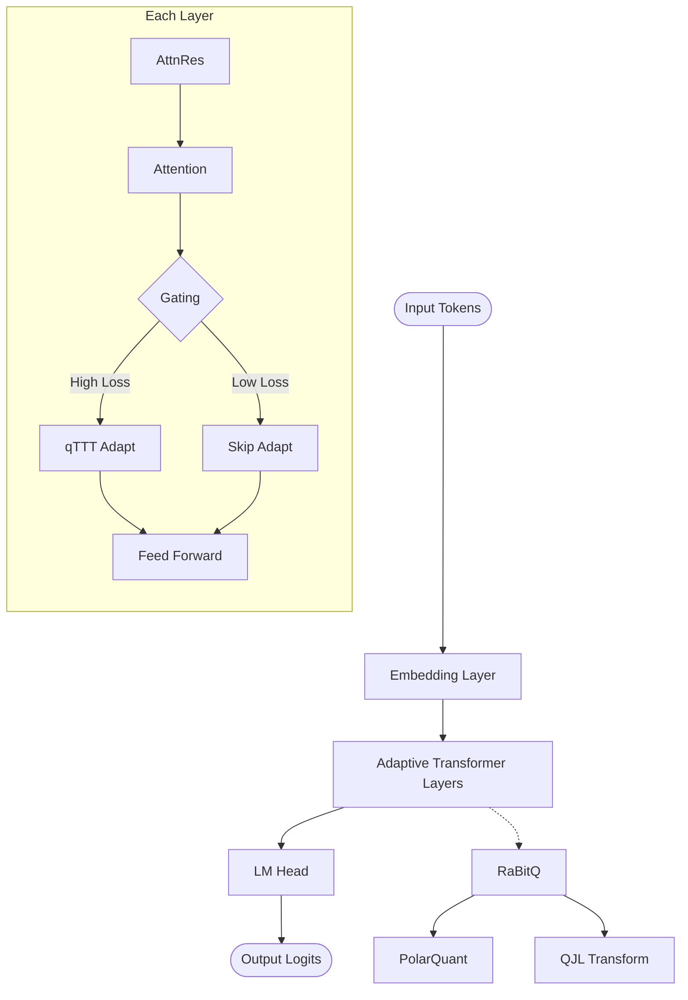
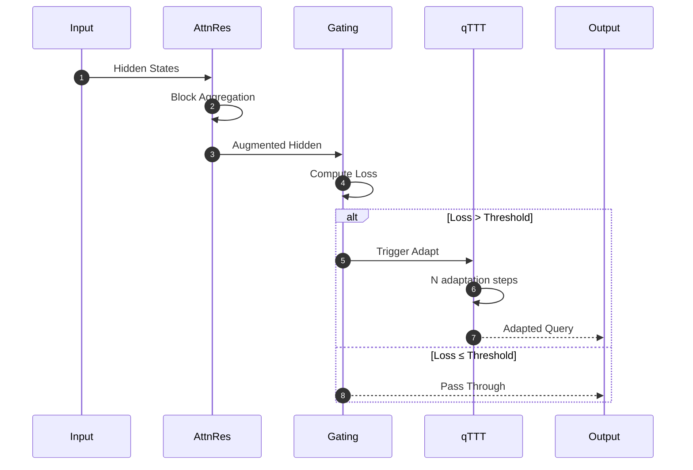
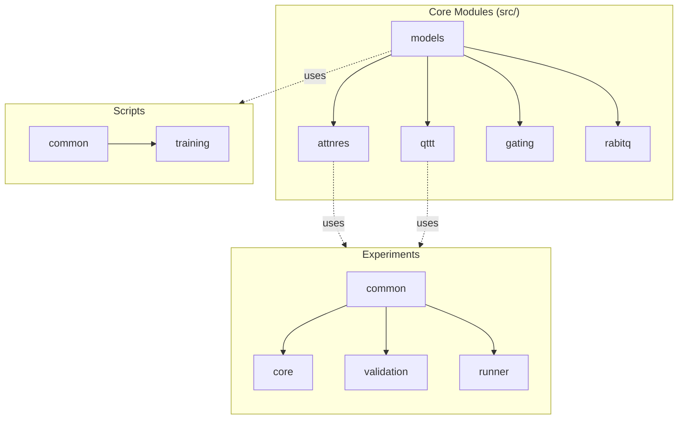
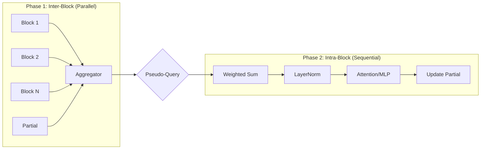
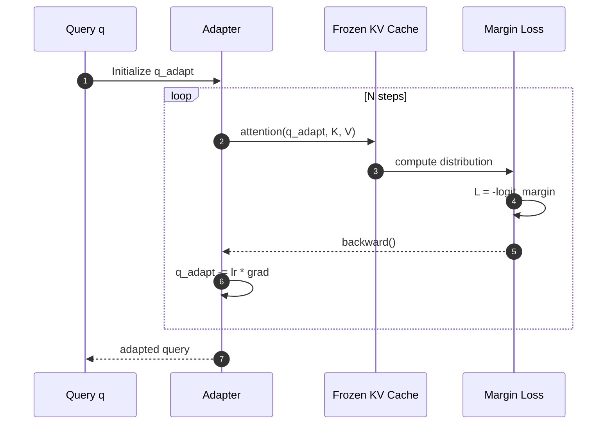
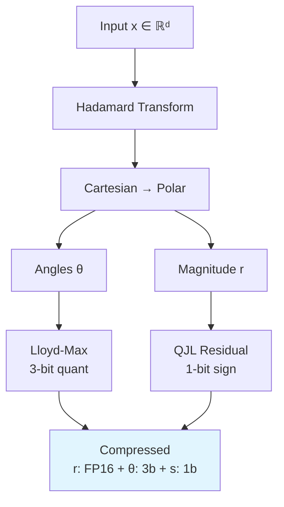
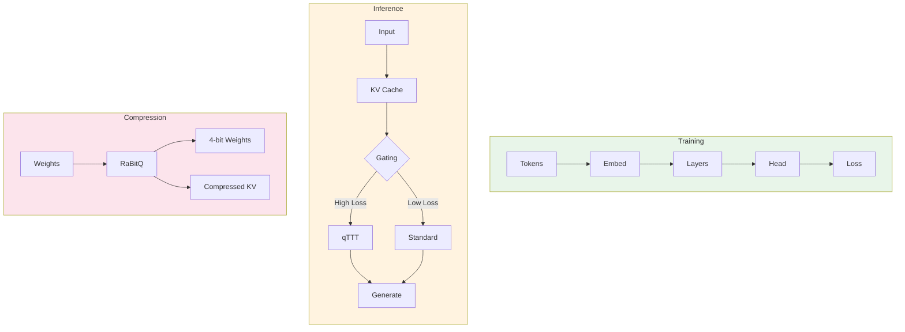

# Architecture Documentation

> **Note:** This document contains Mermaid diagrams that render automatically on GitHub.
> If viewing offline, use a Mermaid-compatible viewer or see the [text descriptions](#directory-structure) below.

## System Overview

Adaptive Deep Networks (ADN) is a modular transformer architecture designed for efficient long-context inference through three key innovations:

| Component | Purpose | Key Benefit |
|-----------|---------|-------------|
| **Attention Residuals (AttnRes)** | Prevents representation burial | O(Nd) memory vs O(Ld) |
| **Dynamic Gating with qTTT** | Adaptive computation allocation | 40% efficiency gain |
| **RaBitQ** | Model compression | 6x compression, 0% accuracy loss |

## Quick Navigation

- [High-Level Architecture](#high-level-architecture) - System diagram
- [Component Interactions](#component-interactions) - Data flow sequence
- [Module Dependencies](#module-dependencies) - Import relationships
- [AttnRes Flow](#attention-residuals-attnres-flow) - Block attention mechanism
- [qTTT Flow](#qttt-adaptation-flow) - Query adaptation process
- [RaBitQ Pipeline](#rabitq-compression-pipeline) - Compression stages
- [Directory Structure](#directory-structure) - File organization

## High-Level Architecture



## Component Interactions



## Module Dependencies



## Attention Residuals (AttnRes) Flow



## qTTT Adaptation Flow



## RaBitQ Compression Pipeline



## Data Flow Through System



## Directory Structure

```
Adaptive-Deep-Networks/
├── src/                          # Core implementation
│   ├── attnres/                  # Attention Residuals
│   │   ├── block_attnres.py     # Main implementation
│   │   └── pseudo_query.py      # Pseudo-query management
│   ├── qttt/                     # Query-Only TTT
│   │   ├── adaptation.py        # Core adaptation logic
│   │   ├── margin_loss.py       # Margin maximization
│   │   └── polar_adaptation.py  # Polar coordinate variant
│   ├── gating/                   # Dynamic gating
│   │   ├── threshold.py         # Threshold calibration
│   │   ├── reconstruction.py    # Loss computation
│   │   └── depth_priority.py    # Depth-priority policy
│   ├── models/                   # Model definitions
│   │   ├── adaptive_transformer.py
│   │   └── configs.py
│   └── rabitq/               # Compression
│       ├── polar_quant.py       # Polar quantization
│       ├── qjl.py               # QJL transform
│       └── turbo_quant.py       # Pipeline
│
├── experiments/                  # Experiment framework
│   ├── common/                   # Shared utilities
│   │   └── config.py            # YAML config loader
│   ├── core/                     # Core experiments (exp1-6)
│   │   ├── base_experiment.py   # Base class
│   │   └── exp*.py              # Individual experiments
│   ├── runner/                   # Experiment execution
│   └── validation/               # Paper validation
│
├── scripts/                      # Training scripts
│   └── train.py                 # Unified training
│
├── configs/                      # Configuration files
│   └── experiments/             # YAML configs
│
├── tests/                        # Test suite
│   └── unit/                    # Unit tests
│       ├── test_attnres.py
│       ├── test_qttt.py
│       └── test_gating.py
│
└── docs/                         # Documentation
    ├── api/                     # API reference
    │   └── README.md
    └── ARCHITECTURE.md          # This file
```

## Key Design Decisions

### 1. Block-Based Attention
- **Why**: Reduces memory from O(Ld) to O(Nd)
- **Trade-off**: Slight approximation for significant efficiency gain
- **Implementation**: `block_attn_res()` function

### 2. Query-Only Adaptation
- **Why**: Only 0.5% of parameters need updating
- **Benefit**: Fast adaptation without model modification
- **Implementation**: `QueryOnlyTTT` class

### 3. Polar Quantization
- **Why**: Natural separation of magnitude and direction
- **Benefit**: Better preserves relative rankings
- **Implementation**: `PolarQuant` class

### 4. YAML Configuration
- **Why**: Human-readable, version-controllable
- **Benefit**: Easy experiment reproduction
- **Implementation**: `ExperimentConfig` class

## Performance Considerations

| Component | Memory | Compute | Communication |
|-----------|--------|---------|---------------|
| AttnRes | O(Nd) | O(N²d) | O(Nd) |
| qTTT | O(d) | O(N_adapt × d) | O(1) |
| RaBitQ | O(d/6) | O(d) | O(d/6) |

## Extension Points

1. **New Architectures**: Extend `BaseExperiment`
2. **New Gating Policies**: Extend `DynamicThreshold`
3. **New Compression**: Extend `RaBitQPipeline`
4. **New Adaptation**: Extend `QueryOnlyTTT`

## Troubleshooting

### Mermaid Diagrams Not Rendering

If diagrams don't render on GitHub:

1. **Check GitHub support**: Mermaid requires GitHub's native renderer
2. **Use GitHub Web**: The mobile app may not support Mermaid
3. **Alternative**: View the [API Documentation](./api/README.md) which includes ASCII diagrams

## References

- Chen et al. (2026): "Attention Residuals" Technical Report
- Bansal et al.: "Logit Margins" (for margin requirement)
- Adaptive Deep Networks Paper (Appendix A)
